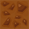

# Pygame-Project

## Управление

- d - движение вправо
- a - джижение влево
- w - движение вверх по лестнице
- s - движение вниз по лестнице
- L_SHIFT - ускорение
- SPACE - прыжок
- ESC - пауза

## Символы для построения уровня

">" - враг который будет двигаться вправо  
"<" - враг который будет двигаться влево  
"@" - основной игрок  

Названия файлов без расширения из папки data/textures/tiles можно указывать в построении уровня.
Имя файла будет соответствовать изображению

Пример:

На месте символа "a" на уровне нарисуется изображение:



### Все символы

"!" - blade.png  
"$" - bush1.png  
"%" - bush2.png  
"^" - button.png  
":" - cell.png  
"&" - door.png  
"=" - key.png  
"+" - coin.png  
"|" - crystal.png    
"1" - flower1.png  
"2" - flower2.png  
"3" - flower3.png  
"4" - flower4.png  
"5" - flower5.png  
"6" - heart.png  
"7" - box1.png  
"8" - box2.png  
"9" - tree1.png  
"0" - tree2.png  
"*" - pointer.png  
" " или "#" - пустое место уровня  
"/" - Невидимая стена для врага  
"\\" - Невидимая стена для игрока  
"'" - thorns1.png  
""" - thorns2.png  
"," - stairs.png  
"-" - scarecrow.png

## Добавление своих уровней

Внутри функции `select_level` необходино создать экземпляр `SelectLevelSprite(center_x, center_y, number_level)`

Далее нобходимо создать файл с именем состоящим из номера уровня с расширением .lvl в папке data/levels

Для удобства вы можете сразу загружать уровень.  
Для этого достаточно закоментировать строку 1207 `player, level = menu.show()`, создать уровень `level = Level(number_level)` и начать его генерацию `player = level.generate()`  
Пример:
```
# player, level = menu.show()
level = Level(1)
player = level.generate()

while True:
    for event in pygame.event.get():
        if event.type == pygame.QUIT:
            terminate()...
```

## Изменение поведения разных объектов

Изменить поведение разных объектов уровня можно при помощи словаря `GAME_OBJECTS_DICT`.
Ключ является символом, который прописывается на место спрайта в файле уровня.    
Значение состоит из нескольких элементов:
1. Название файла из папки data/textures/elements
2. Словарь с его свойствами:
    1. COLLIDED: Будет ли распозноваться пересечение объекта с персонажами
    2. COLLIDED_DO_KILL: Смерть при столкновении (только при актовном первом пункте), отностися только к игроку
    3. COLLIDED_PLAYER: Будет ли игрок сталкиваться с данным объектом (только при актовном первом пункте)
    4. COLLIDED_ENEMY: Будет ли враг сталкиваться с данным объектом (только при актовном первом пункте)
    5. SIZE: Кортеж состоящий из ширины и высоты объекта в пикселях
    
Если не указывать некоторые или все параметры, то значения по умолчанию будут следующие:
1. COLLIDED: False
2. COLLIDED_DO_KILL: False
3. COLLIDED_PLAYER: False
4. COLLIDED_ENEMY: False
5. SIZE: (48, 48)

Пример:  
`'!': ('blade.png', {COLLIDED: True, COLLIDED_DO_KILL: True, COLLIDED_PLAYER: True, COLLIDED_ENEMY: False, SIZE: (48, 96)})`

Примачаие:  
Объекты которые имеют специальное назначение. Менять их поведение не рекомендуется
- "6" (heart.png) - дополнительная жизнь
- "*" (pointer.png) - чек-поинт
- "^" (button.png) - платформа для прыжка (батут)
- "=" (key.png) - квестовый ключ
- "&" (door.png) - дверь конца уровня
- "+" (coin.png) - монета которую можно забрать
- "|" (crystal.png)  - кристалл который можно забрать
- "," (stairs.png) - лестница

## Добавление собственных объектов

Вы можете доавлять свои собственные объекты с тексурами. Для этого необходимо в папку data/textures/elements
добавить изображение в формате .png и добавить его описание в словарь `GAME_OBJECTS_DICT`.
Документация по пользованию словарем в пункте "Изменение поведения разных объектов"

## Особенности

- На уровне может быть только один игрок
- На уровня обязательно должны присутствовать дверь("&" (door.png)) и ключ ("=" (key.png))
- Спрайт врага не начнет двигаться до тех пор, пока его не захватит камера
- Основной размер всех объектов уровня равен 48x48 px
- Чем меньше на уровне объектов, там быстрее загрузится уровень
